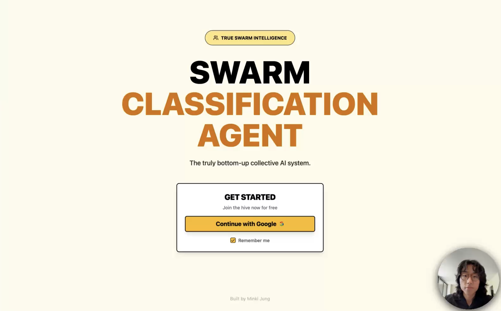
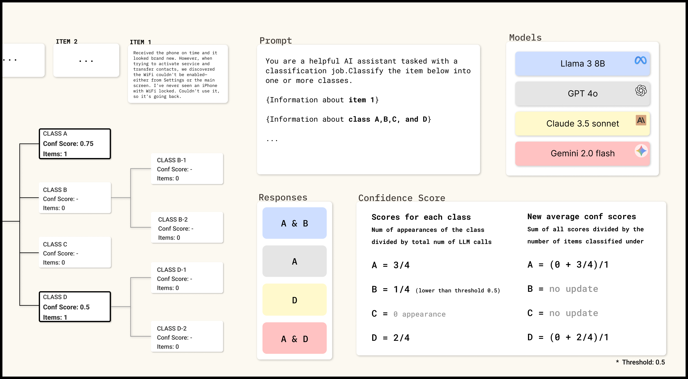

## Self‑Evolving Taxonomy Agent

An end‑to‑end system that helps you build, classify, and continuously evolve a taxonomy for unstructured text items. The backend orchestrates multi‑model parallel classification and human‑in‑the‑loop refinement via LangGraph; the frontend provides an interactive UI with live updates over WebSockets.

### Why a real swarm agent?
- Most "swarm" agents are still top‑down: a central planner hands off tasks to sub‑agents. That’s organizational, not collective.
- In nature, bee hives and ant colonies work bottom‑up with local information and no central controller. That’s the target here.
- Bottom‑up systems are more reliable, scalable, model(llm)‑agnostic, and steerable—perfect for LLMs whose strengths are local reasoning and parallelism.

This project implements a truly collective, bottom‑up classification agent inspired by bee foraging: many simple agents (LLM calls) produce signals that accumulate in shared "stocks" and trigger actions via feedback loops—no single decision maker.

### A better memory scaffolding for LLMs
LLMs are stateless and long‑context is expensive. Traditional "trajectory summaries" are lossy; multi‑agent hierarchies reintroduce centralization. Instead, we externalize memory into measurable stocks:
- Agents only need local context to produce signals.
- Aggregations (stocks) are cheap to compute and robust to noise.
- Feedback loops guide evolution without a global narrator.

### Conceptual model (stock and flow)
Think of a tap filling a tub: inflow raises water until a balancing mechanism engages. In our system:
- Inflow = confidence contributions from many model votes per item.
- Stock = aggregated confidence per class/node over time.
- Feedback = human intervention and structure updates when thresholds indicate weak branches.

### What it does
- **Create initial nodes**: Bootstrap a taxonomy from a sample of your items.
- **Classify items**: Run batches where multiple LLMs vote; aggregate results with thresholds/majority rules.
- **Evolve structure**: Detect weak nodes, examine them, and add/adjust children.
- **Human‑in‑the‑loop**: Verify labels, curate few‑shot examples, and guide the swarm.
- **Live feedback**: Real‑time progress via WebSocket events.

### How it works (high level)
1) For each item, N configured models classify into candidate classes. If all choose A → score(A)=1.0; if half choose A → score(A)=0.5. These are the inflows.

2) As more items are classified, each node accumulates confidence. We monitor averages per node—these are the stock levels we visualize.

3) Users steer the swarm by verifying labels, restructuring branches, and selecting few‑shot examples (manually or via DSPy). These are balancing feedback mechanisms that improve performance without central control.

Why not 100% autopilot? Topic taxonomy is inherently subjective; the right structure depends on intent and use case. A human‑guided UI that exposes state and invites intervention performs better than opaque automation.

### Learn more about the swarm logic
[Watch the swarm agent walkthrough on YouTube](https://youtu.be/szEeaPVBYSo)




### Tech stack
- Backend: FastAPI, Motor/MongoDB, LangGraph/LangChain, Authlib (Google OAuth), JWT, WebSockets
- Frontend: React (Vite + TypeScript), shadcn/ui, TanStack Query, WebSockets

## Quick start

### 0) Prerequisites
- Python 3.12+
- Node.js 18+
- A running MongoDB (Docker example below)
- An OpenAI and/or Anthropic API key (optional but required for real classification)
- Google OAuth Client (for login)

Run MongoDB locally (recommended):

```bash
docker run -d --name mongodb -p 27017:27017 -v mongodb_data:/data/db mongo:7
```

### 1) Backend setup
1. Create `backend/.env` with at least:

```env
# Required
LOG_LEVEL=info
SECRET_KEY=change-me
MONGODB_URL=mongodb://localhost:27017
MONGODB_DB_NAME=taxonomy_agent
BACKEND_CORS_ORIGINS=["http://localhost:3000"]
FRONTEND_URL=http://localhost:3000

# Google OAuth (create a Web app OAuth client)
GOOGLE_CLIENT_ID=your-google-client-id
GOOGLE_CLIENT_SECRET=your-google-client-secret
# Must match the backend callback route
GOOGLE_REDIRECT_URI=http://localhost:8000/api/v1/auth/google/callback

# Optional LLM keys
OPENAI_API_KEY=your-openai-key
ANTHROPIC_API_KEY=your-anthropic-key

# Optional tracing
LANGSMITH_TRACING=false
LANGSMITH_API_KEY=
LANGSMITH_PROJECT=
```

2. Install deps and run the API (we use uv; install via Homebrew `brew install uv` or `pipx install uv`):

```bash
cd backend
uv sync
uv run python main.py
# API: http://localhost:8000  |  Docs: http://localhost:8000/docs
```

### 2) Frontend setup
1. Create `frontend/.env`:

```env
VITE_API_URL=http://localhost:8000
```

2. Install and run:

```bash
cd frontend
npm install
npm run dev
# App: http://localhost:3000
```

### 3) Google OAuth setup
- In Google Cloud Console → Credentials → OAuth client IDs (Web application):
  - Authorized redirect URI: `http://localhost:8000/api/v1/auth/google/callback`
- Ensure the values match your `backend/.env` and `frontend/.env`.

### 4) First run (high‑level)
- Open the app at `http://localhost:3000`, click "Continue with Google" to sign in.
- Create a taxonomy (name + aspect) from the UI.
- Upload items (e.g., paste text lines or use a JSONL).
- Initialize nodes from a sample of items.
- Start classification; watch live updates.
- Use human‑in‑the‑loop tools to verify, adjust nodes, and refine few‑shot examples.

## Repository structure
- `backend/`: FastAPI API, MongoDB models, LangGraph classifiers, WebSocket hub
- `frontend/`: React app (Vite + TS) UI, REST/WebSocket client

See detailed READMEs in `backend/README.md` and `frontend/README.md` for component‑specific docs, env vars, and APIs.


